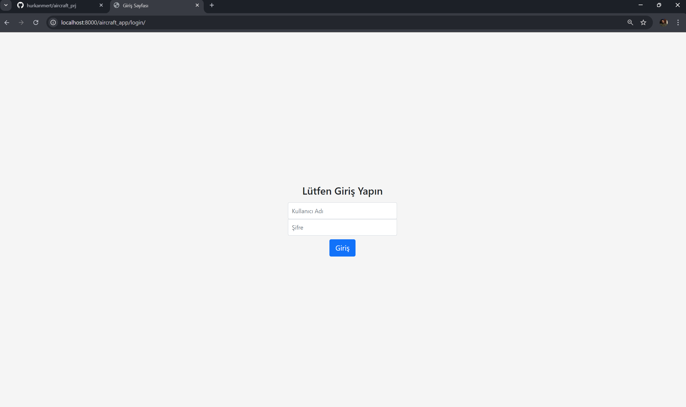
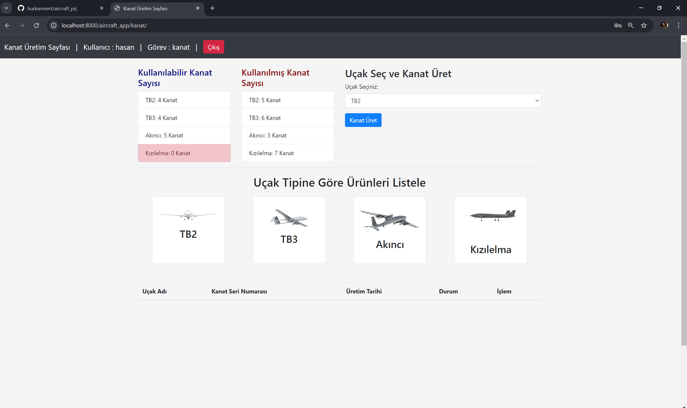
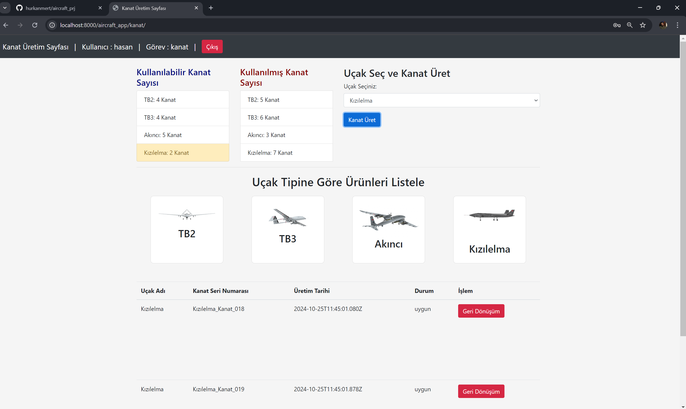
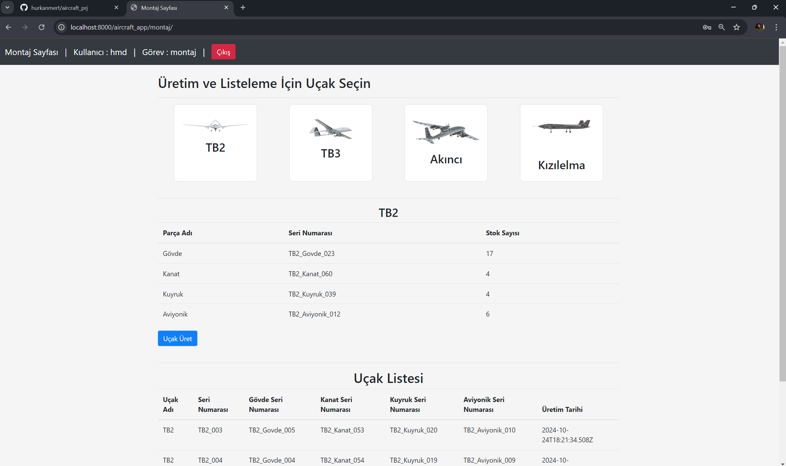
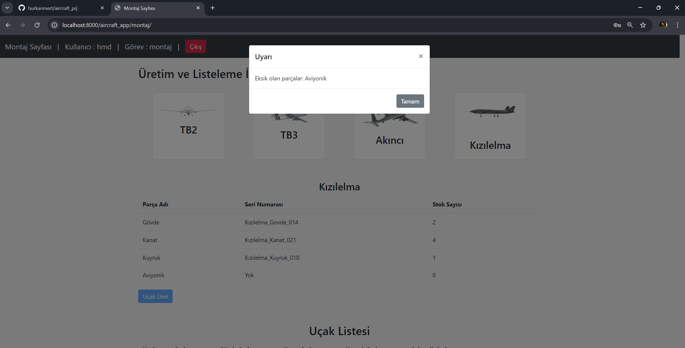
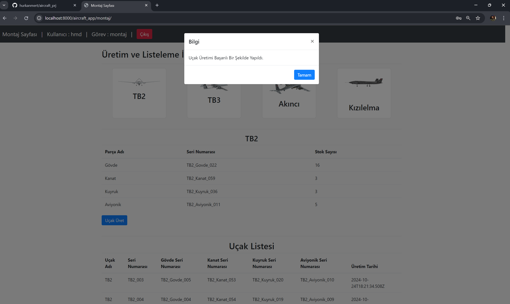
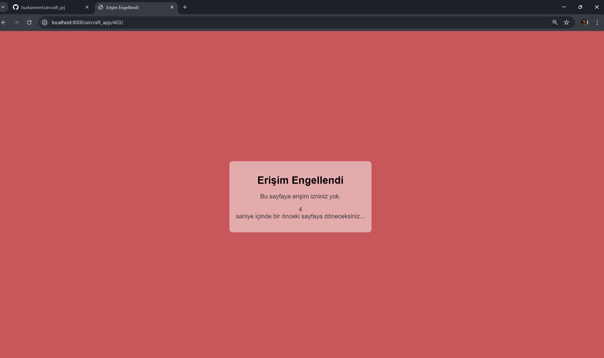
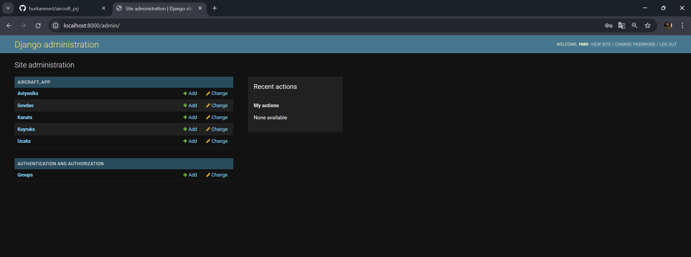

# ✈️ Aircraft Assembly Management System

[](https://python.org)
[](https://djangoproject.com)
[](https://django-rest-framework.org)
[](https://postgresql.org)

---

## 📌 About

A role-based web application for end-to-end aircraft assembly management. Each user role can only access its own production page; the assembly team verifies part availability across all components and performs final aircraft production.

---

## 🚀 Features

- 🔐 **Role-based authentication** — 5 user roles: Wing, Body, Tail, Avionics, Assembly
- 🏭 **Part production management** — Each team produces its own part type with auto-assigned serial numbers
- 🟡🔴 **Stock alert system** — Yellow warning below 3 units, red warning at 0 units
- ⚙️ **Assembly validation** — Production is blocked if any part is missing; missing parts are reported
- 📋 **Aircraft registry** — Full component serial numbers and production date recorded for every aircraft
- 🚫 **Page access control** — Unauthorized access triggers a 5-second countdown and 403 redirect
- 🔄 **Real-time updates via AJAX** — Stock counts update without page refresh
- 🛠️ **Django Admin** — All models and user management accessible from the admin panel

---

## 🖼️ Screenshots

### Login


### Wing Production


### Stock Warnings
> Yellow: stock ≤ 3 | Red: stock = 0



### Assembly — Parts Check


### Missing Part Warning


### Production Success


### Access Denied (403)


### Django Admin Panel


---

## 🛠️ Tech Stack

| Layer | Technology |
|-------|-----------|
| Backend | Python, Django, Django REST Framework |
| Database | PostgreSQL |
| Frontend | HTML, CSS, JavaScript, Bootstrap |
| Async | AJAX (no page reload updates) |
| Admin | Django Admin (customized) |

---

## 🏗️ Architecture Decisions

**Django REST Framework** — Part stock data and assembly operations are managed through a REST API, decoupling the frontend from the backend. This allows future integration of a mobile app or alternative frontend with minimal changes.

**AJAX for async updates** — Stock counts update after each production action without a full page reload, significantly improving the user experience.

**Custom User Model** — Django's default user model was extended with a `role` field, allowing each user to be assigned a production role and enabling view-level authorization based on that role.

**PostgreSQL** — Chosen for its relational data structure (foreign key relationships between aircraft and parts) and reliable production history queries.

---

## ⚙️ Installation

### Requirements
```bash
pip install -r requirements.txt
```

### Database Setup
```bash
# Create a new PostgreSQL database
# Update database credentials in settings.py

python manage.py migrate
python manage.py createsuperuser
```

### Load Sample Data
```bash
psql -U postgres -d <database_name> < backup_db.sql
```

### Run Server
```bash
python manage.py runserver
```

Open in browser: `http://localhost:8000/aircraft_app/login/`

---

## 👥 Test Users

| Username | Role | Password |
|----------|------|----------|
| hasan | Wing | 12345 |
| veli | Tail | 12345 |
| ali | Tail | 12345 |
| ahmet | Body | 12345 |
| mert | Avionics | 12345 |
| hmd | Assembly | 12345 |

> To access the admin panel: `python manage.py createsuperuser`

---

## 🔗 API Endpoints

| Endpoint | Method | Description |
|----------|--------|-------------|
| `/aircraft_app/login/` | GET/POST | User login |
| `/aircraft_app/kanat/` | GET/POST | Wing production & listing |
| `/aircraft_app/govde/` | GET/POST | Body production & listing |
| `/aircraft_app/kuyruk/` | GET/POST | Tail production & listing |
| `/aircraft_app/aviyonik/` | GET/POST | Avionics production & listing |
| `/aircraft_app/montaj/` | GET/POST | Assembly & aircraft production |
| `/aircraft_app/403/` | GET | Access denied page |
| `/admin/` | GET | Django admin panel |

---

## 📁 Project Structure

    aircraft_prj/
    ├── aircraft_app/          # Main application
    │   ├── models.py          # Wing, Body, Tail, Avionics, Aircraft, User models
    │   ├── views.py           # Role-based views
    │   ├── serializers.py     # DRF serializers
    │   ├── urls.py            # URL routing
    │   └── templates/         # HTML templates
    ├── aircraft_prj/          # Project settings
    │   └── settings.py
    ├── backup_db.sql          # Sample data
    └── requirements.txt

---

## 📝 License

This project is open source.
